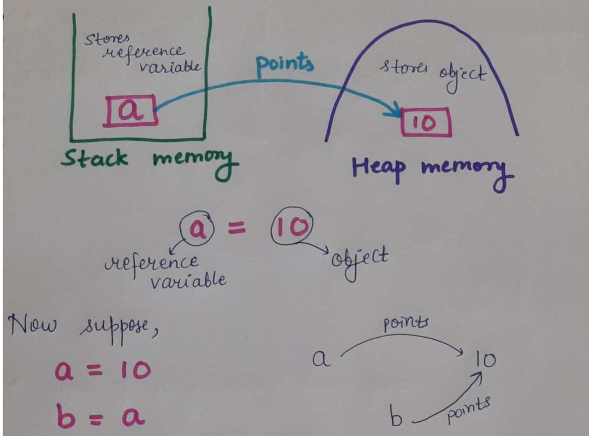

# Intro to Programming, Flow of Program, Intro to Java, First Java program

- Introduction to Programming - Types of Languages, Memory Management
- Flow of Program - Flowcharts & Pseudocode
- Introduction to Java - Architecture & Installation
- First Java Program - Input/Output, Debugging and Datatypes

---

## Introduction to programming

### Types of Programming languages:

1. Procedural
2. Functional
3. Oject-oriented

| Static                                | Dynamic                                                     |
| ------------------------------------- | ----------------------------------------------------------- |
| Perform type checking at compile time | Perform type checking at runtime                            |
| Error shown at compile time           | Error might not show till program runs                      |
| Declare datatypes before use          | No need to declare datatype of vars                         |
| More control                          | Saves time in writing code but might give errors at runtime |

## Memory Management

- More than one ref var can point towards same object.
- If any of the ref var changes the object then it is changed for all ref vars that points towards the same object.

- The objects that don't have any ref vars pointing towards them are removed by programming languages. This is called **_garbage collection_**.

## Flow of program and flowchart

Flowchart symbols

- Oval - Start / Stop
- parallelogram - Input / output
- Rectangle - processing
- Diamond - Condition
- Arrow - flow direction

---

## Introduction to Java

---

## First java program
